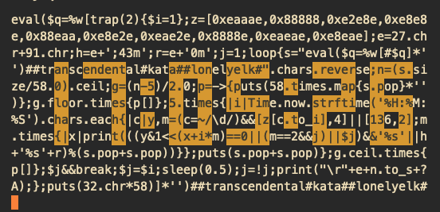

# Visual Effects

Here is some assortment of quines that use ASCII graphics and animation. As you can imagine writing
a program as ASCII code or a rectangle of symbols is problematic, so there are versions that can
give you insight into how this was built.

## Elk Jump

My first quine with a payload. It's just dear to me.

## Terminal Color Clock



Running the clock and its generator yields the same result:

```shell
ruby clock.rb
# or
ruby clock_generator.rb
```

## Cresta Logo


In July 2025 the company I work for — [Cresta][cresta] released its new logo and corporate design.
I was in love with Lissajous' curves way back when, so I naturally wanted to animate that.
And quine is just a great media to do that:

```shell
ruby logo.rb
# or
ruby logo_generator.rb
```

<!-- links -->

[cresta]: https://cresta.com/